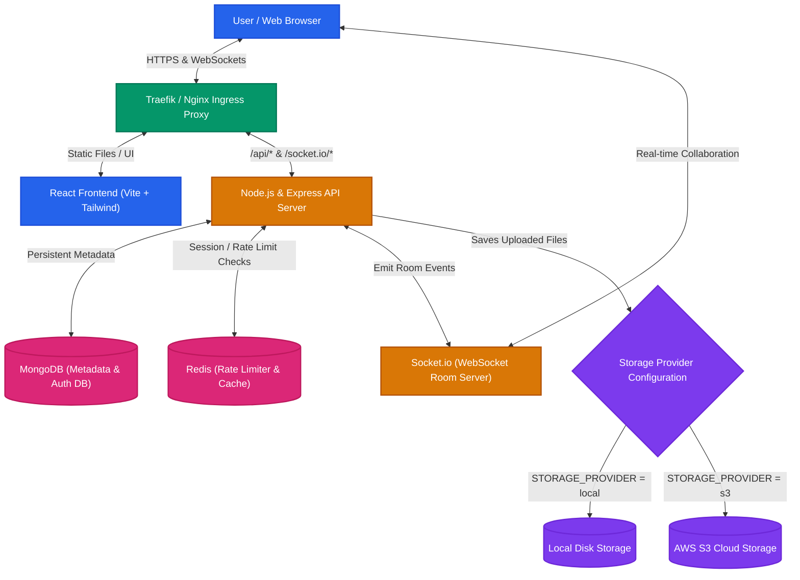

# DriveCloud 📁☁️
### A Distributed File Storage and Collaboration Platform (Google Drive Clone)

DriveCloud is a feature-rich, production-ready distributed file storage and management system. It features real-time collaboration, instant file/folder sharing, advanced file organization, automatic thumbnail generation, JWT-based security, multi-provider storage backend (Local Disk or AWS S3), and is fully containerized and deployable to Kubernetes.

---

## 🚀 Key Features

* **Advanced File Uploads**: Support for drag-and-drop, folder uploads, chunked uploads for large files, pause/resume, and duplicate detection.
* **Organized Storage**: Unlimited nested folder structures with custom folder colors, starred items, and a 30-day retention trash bin with restore capabilities.
* **Rich Preview Engine**: Live file previews for images, videos, audio, PDFs, text, and code with syntax highlighting.
* **Granular Sharing**: Generate secure public download links (with optional passwords and expiration dates) or share internally with other platform users (Viewer vs. Editor permissions).
* **Real-time Collaboration**: Built-in collaborative text/markdown editing and presence indicators using Socket.io.
* **Flexible Storage Providers**: Easily switch between local file system storage or AWS S3 cloud buckets via simple environment variables.
* **Production-Ready Operations**: Kubernetes-ready deployments, CI/CD Jenkinsfile, Docker Compose support, and Prometheus metrics.

---

## 🗺️ System Architecture

Below is the conceptual flow showing how the React Client, Reverse Proxies, Node.js API server, databases, storage providers, and real-time Socket.io layers interact:



---

## 🛠️ Step-by-Step Installation & Local Setup

### 1. Prerequisites
Make sure you have the following installed on your machine:
* **Node.js** (v18.x or v20.x recommended)
* **MongoDB** (Local instance running or a MongoDB Atlas Connection String)
* **npm** or **yarn**

---

### 2. Clone the Repository
```bash
git clone https://github.com/your-username/distributed-file-upload.git
cd distributed-file-upload
```

---

### 3. Install Dependencies
Run the utility script from the root directory to install dependencies for both the frontend and backend applications:
```bash
npm run install:all
```

---

### 4. Configure Backend Environment Variables
Create a file named `.env` in the `backend` folder:
```bash
touch backend/.env
```
Copy and update the following configuration template inside `backend/.env`:

```env
PORT=5001
NODE_ENV=development

# Database Connection (MongoDB local or Atlas)
MONGODB_URI=mongodb+srv://<username>:<password>@cluster.mongodb.net/drivecloud?retryWrites=true&w=majority

# JWT Token Security (Change in production)
JWT_SECRET=drivecloud_super_secure_jwt_key_change_in_production_2026
JWT_REFRESH_SECRET=drivecloud_refresh_secret_key_change_in_production_2026
JWT_EXPIRE=7d
JWT_REFRESH_EXPIRE=30d

# File Settings
UPLOAD_DIR=uploads
THUMBNAIL_DIR=thumbnails
MAX_FILE_SIZE=104857600       # 100MB in bytes
DEFAULT_STORAGE_LIMIT=16106127360  # 15GB in bytes

# Frontend Base URL
FRONTEND_URL=http://localhost:5173

# Email Configurations (For resetting passwords)
SMTP_USER=your_email@gmail.com
SMTP_PASS=your_email_app_password

# ============================================================
# AWS S3 Cloud Storage Configurations (Optional)
# To use S3 storage: Change STORAGE_PROVIDER from 'local' to 's3'
# ============================================================
STORAGE_PROVIDER=local
AWS_REGION=us-east-1
AWS_ACCESS_KEY_ID=your_aws_access_key
AWS_SECRET_ACCESS_KEY=your_aws_secret_key
AWS_S3_BUCKET=your_s3_bucket_name
```

---

### 5. Run the Application in Development Mode
Start both backend API and React Vite dev servers concurrently by running the following command in the root folder:
```bash
npm run dev
```

* **Frontend UI**: `http://localhost:5173`
* **Backend API**: `http://localhost:5001`
* *Note: The React Vite server is pre-configured to proxy `/api` and `/socket.io` calls to port `5001`.*

---

## 🐳 Run Locally Using Docker Compose

If you want to spin up the entire application locally using Docker:

1. **Start the containers**:
   ```bash
   docker-compose up --build
   ```
2. **Access the application**:
   Open `http://localhost` in your browser. Nginx inside the frontend container acts as a reverse proxy routing API and socket connections automatically.

---

## ☸️ Production Deployment on Kubernetes

The deployment files are located inside the `k8s/` directory. Deploy the cluster components stepwise:

### 1. Create the Namespace
```bash
kubectl apply -f k8s/namespace.yaml
```

### 2. Configure Secrets
Open `k8s/backend-secrets.yaml` and update the base64-encoded values of your MongoDB URI, JWT Secrets, and SMTP credentials. 
*Encode values using:* `echo -n "value" | base64`
Apply secrets configuration:
```bash
kubectl apply -f k8s/backend-secrets.yaml
```

### 3. Deploy Backend and Frontend Services
```bash
kubectl apply -f k8s/backend-deployment.yaml
kubectl apply -f k8s/frontend-deployment.yaml
```

### 4. Deploy Ingress Routing
Apply the Traefik-supported ingress layer:
```bash
kubectl apply -f k8s/ingress.yaml
```

---

## 🤖 CI/CD Integration (Jenkins)

The project includes a `Jenkinsfile` for continuous integration and delivery. Setting up Jenkins to scan this repository will execute:
1. **Checkout**: Pull code from Git.
2. **Build**: Dockerize both backend and frontend.
3. **Push**: Tag and push containers to Docker Hub (`kundan333/drivecloud-backend` & `kundan333/drivecloud-frontend`).
4. **Deploy**: Deploy namespaces, secrets, workloads, and rolling restarts into the cluster (K3s).
5. **Verify**: Run readiness rollout validations.

---

## 📈 Monitoring & Health Metrics

A Prometheus configurations template is provided under `monitoring/prometheus.yml`. 
* **Metrics Endpoint**: The backend exposes node metrics and service health at `/api/health`.
* **Prometheus Setup**: Register `backend:5001` under targets in Prometheus scrape configs to track request counts, memory usage, and storage limits.

---

## 📂 Project Directory Structure

```text
├── backend/
│   ├── config/             # Database and configuration constants
│   ├── controllers/        # Express request handling logic (auth, file, folder, share, user)
│   ├── middleware/         # Rate limiters, validators, file uploads, error handlers
│   ├── models/             # Mongoose/MongoDB data schemas (User, File, Folder, Share, Activity)
│   ├── routes/             # REST endpoints definition
│   ├── services/           # Storage handlers (switching between S3 and Local)
│   ├── utils/              # Helper utilities (e.g. thumbnailGenerator)
│   ├── Dockerfile          # Backend container image recipe
│   └── server.js           # Server startup script
├── frontend/
│   ├── src/
│   │   ├── api/            # Axios API calls definition
│   │   ├── components/     # UI Component library (cards, tables, upload dialogs, previews)
│   │   ├── pages/          # Main application page views (Dashboard, Login, Share, Trash)
│   │   ├── store/          # Zustand State Management stores
│   │   └── App.jsx         # App route management
│   ├── Dockerfile          # Frontend container image recipe
│   ├── nginx.conf          # Nginx routing rules for production serving
│   └── vite.config.js      # Vite build configurations with dev server proxies
├── k8s/                    # Kubernetes manifests (deployments, namespace, ingress, secrets)
├── monitoring/             # Prometheus scrapers metrics config
├── docker-compose.yml      # Orchestration setup for easy local running
└── Jenkinsfile             # Automation script for CI/CD deployments
```

---

## 📜 License
Distributed under the MIT License. See `LICENSE` for more information (if applicable).
